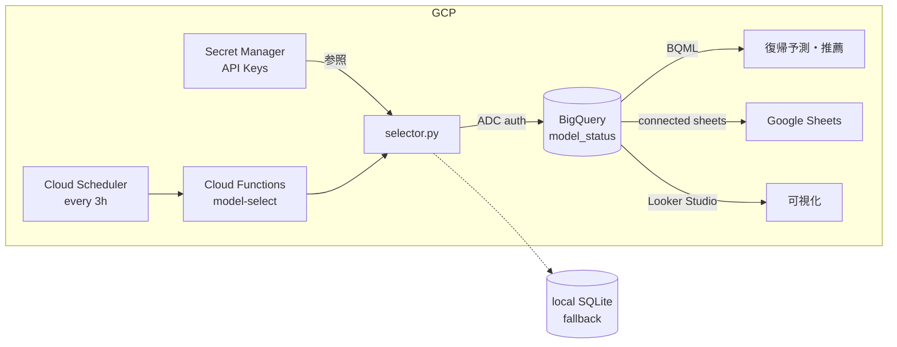
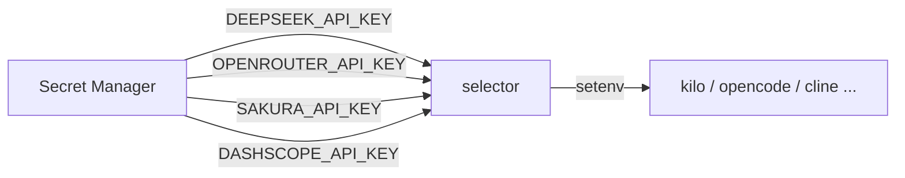

# ADR-005: model-status.db 設置場所

**日付**: 2026-06-21
**ステータス**: 検討中

## コンテキスト

`model-status.db` (SQLite) は全CLIから参照される動的モデル状態 DB。クォータ残量・使用実績・復帰予測・MLパラメータを含む。複数のCLI（kilo, opencode, cline, hermes）が読み書きする。

設置場所の候補:
1. `%APPDATA%/model-manager/` (Roaming, 現状)
2. `MEGA/` (プロジェクト直下, git管理外)
3. `MEGA/` (プロジェクト直下, git管理対象)
4. クラウド同期フォルダ (OneDrive/Dropbox)

## 選択肢

### A. %APPDATA%/Roaming (現状維持)

| 観点 | 評価 |
|------|------|
| 同期 | なし (ローカルPCのみ) |
| 信頼性 | 高い (ディスク障害時消失リスクあり) |
| 全CLIからの参照 | 全CLIが %APPDATA% を読めるので問題なし |
| WSL連携 | PATH通せば可 |
| バックアップ | なし |
| 複数PC | 非対応 |

### B. MEGA/ プロジェクト直下 (git管理外, .gitignore)

| 観点 | 評価 |
|------|------|
| 同期 | MonoFS でクラウド同期 (MEGA フォルダ自体がクラウド) |
| 信頼性 | クラウド同期あり (複数PCで共有可能) |
| 全CLIからの参照 | 全CLIが `MEGA/` を参照できるので問題なし |
| WSL連携 | WSL → `/mnt/c/.../MEGA/` で可 |
| 排他制御 | SQLite WALモードで同時書き込み対応 |
| 注意 | 同期中にファイルがロックされる可能性 |

### C. GitHub リポジトリ

| 観点 | 評価 |
|------|------|
| 同期 | `git push/pull` |
| 信頼性 | 高い (git 履歴で復元可能) |
| 全CLIからの参照 | `gh repo clone` または submodule で可 |
| 複数PC | ◯ (push/pull で完全同期) |
| 排他制御 | 手動 (commit 単位) |
| 注意 | 頻繁な書き込みで git history が膨張。SQLite バイナリは diff 非対応 → 毎回全ファイル置換 |
| 対策 | `gh api` で Release Asset として管理するか、`selector.py export --format json` を定期 commit するテキスト運用 |

### D. OneDrive / Dropbox 専用フォルダ

| 観点 | 評価 |
|------|------|
| 同期 | クラウド同期 (最速) |
| 信頼性 | 高い |
| 全CLIからの参照 | PATHが環境によって異なる (要設定) |
| 排他制御 | 同期中ロック問題 |
| 依存 | OneDrive/Dropbox 必須 |

### E. Google Sheets (GSheet)

| 観点 | 評価 |
|------|------|
| 接続 | `gspread` (Python) または REST API |
| 信頼性 | Google インフラ、高い |
| 全CLIからの参照 | HTTP API 経由 (どこからでも可) |
| 複数PC | ◎ (クラウドネイティブ) |
| 排他制御 | 行ロックなし、上書き注意 (最終書込勝ち) |
| レイテンシ | API call 〜500ms-2s (SQLite比で遅い) |
| クエリ | 列単位のFILTERのみ (JOIN不可, SQL不可) |
| データ量 | 5M cell 制限 / spreadsheet。今回の用途なら問題なし |
| 同期 | リアルタイム (Google インフラ) |
| 運用 | Web UI で直接編集可能。非エンジニアにも可視 |
| 注意 | API rate limit (60 req/min/user for write)。`usage_log` のような高頻度書き込みには不向き |
| 適正 | 設定値・クォータ状態の参照・手動編集に向く。履歴蓄積には不向き |

**構成案**: GSheet は「現在状態表示板」として使い、実績蓄積は SQLite に残すハイブリッドも可。

### F. Neon (Serverless Postgres)

| 観点 | 評価 |
|------|------|
| 接続 | `psycopg2` / `asyncpg` (Python), 全CLIから接続可 |
| 信頼性 | 高い (managed Postgres, 自動フェイルオーバー) |
| 全CLIからの参照 | TCP接続 (どの環境からでも可) |
| 複数PC | ◎ (サーバーレス) |
| 排他制御 | 行ロック・トランザクション完全対応 |
| レイテンシ | 10-50ms (cold start あり) |
| クエリ | フルSQL (JOIN, 集計, Window関数 すべて可) |
| 無料枠 | 0.5GB, 100h compute / month |
| コスト | 超えたら従量 ($0.05/h compute, $3.5/GB-month) |
| 同期 | リアルタイム (サーバーサイド) |
| ML連携 | pgvector 拡張で埋め込みベクトルも可 (将来のML拡張に有利) |
| 注意 | cold start (5-30s) が発生すると `selector.py` の体感速度に影響。pool 接続で緩和可 |
| 適正 | 長期的なML/分析基盤に最適。ただし cold start のレイテンシが気になるなら軽量用途にはオーバースペック |

**構成案**: Neon を ML分析用 replica とし、実運用はローカルSQLite + 非同期同期。

### G. Cloudflare D1

| 観点 | 評価 |
|------|------|
| 接続 | Workers 経由 REST (HTTP API) |
| 信頼性 | Cloudflare グローバルネットワーク |
| 全CLIからの参照 | HTTP (curl 可、どの環境からでも可) |
| 複数PC | ◎ (クラウドネイティブ) |
| 排他制御 | トランザクション対応 (++ で atomic update) |
| レイテンシ | 50-200ms (Workers + D1) |
| クエリ | SQL (SQLite互換) |
| 無料枠 | 5GB storage, 1M write/mo, 10M read/mo |
| コスト | 超えたら $0.75/M write, $0.225/M read |
| 同期 | Workers API 経由で常に最新 |
| 注意 | 1回のレスポンス上限 1MB。`usage_log` のバルクINSERTには非効率。write unit が1行単位なのでまとめて INSERT すればOK |
| wrangler連携 | `wrangler d1 execute` で手動クエリ可 |
| 適正 | クラウドSQLiteとして理想的な選択。ただし Workers 経由のため CLI から叩くにはラッパーが必要 |

**構成案**: D1 を主DBにし、`selector.py` → Workers (HTTP) → D1 の構成。CLI 使用時は `wrangler d1 execute` か、専用 Worker をデプロイして REST 経由。

### H. Cloudflare D1 (edge cache) + BigQuery (source of truth + BQML)

| 観点 | 評価 |
|------|------|
| 接続 | D1: Workers REST / BQ: `google-cloud-bigquery` Python SDK |
| 信頼性 | D1: Cloudflare edge / BQ: Google 分散インフラ、二重化 |
| 全CLIからの参照 | D1: HTTP (どこからでも) / BQ: 定期同期 Jobs |
| 複数PC | ◎ (両方クラウド) |
| 排他制御 | D1: トランザクション / BQ: 追記のみ（更新はMERGE） |
| レイテンシ | D1: 50-200ms (CLI使用時はこちら) / BQ: 1-10s (分析クエリ) |
| ML | BQML: ARIMA_PLUS (復帰予測), XGBOOST (モデル推薦), すべてSQL |
| 無料枠 | D1: 5GB/1M writes/10M reads 月 / BQ: 10GB storage, 1TB query 月 |
| コスト超過 | D1: $0.75/M writes / BQ: $5/TB query |
| 同期 | D1 → BQ: 定期バッチ or Cloud Scheduler で連携 |
| 可視化 | Looker Studio (旧Data Portal) で BQ 直結ダッシュボード |
| 適正 | CLI即応は D1、長期ML/分析は BQ、住み分けで最強 |

### I. BigQuery 単体 + Secret Manager (GCP 完結)

| 観点 | 評価 |
|------|------|
| 使用頻度 | 3時間に1回程度 -> BQ レイテンシ (1-5s) は許容範囲 |
| API鍵管理 | Secret Manager で一元管理 (全CLIから参照可) |
| 接続 | `google-cloud-bigquery` Python SDK |
| 信頼性 | Google 分散インフラ、99.9%+ |
| 全CLIからの参照 | ADC (Application Default Credentials) 経由 |
| 複数PC | ◎ (GCP ネイティブ) |
| 排他制御 | 追記主体 + MERGE で冪等更新 |
| ML | BQML: ARIMA_PLUS, XGBOOST, すべて SQL |
| 無料枠 | 10GB storage, 1TB query / 月 |
| 可視化 | Looker Studio, Connected Sheets |
| API鍵 | Secret Manager: 無料枠 6 active versions |
| 運用 | Cloud Scheduler + Cloud Functions で定期モデル選択実行 |

**アーキテクチャ**:


**API鍵フロー**:


**BQMLモデル**:
```sql
-- 復帰予測 (ARIMA_PLUS 時系列)
CREATE OR REPLACE MODEL model_status.recovery_model
OPTIONS(model_type='ARIMA_PLUS',
        time_series_timestamp_col='logged_at',
        time_series_data_col='tokens_in',
        time_series_id_col='model_key') AS
SELECT logged_at, model_key, tokens_in
FROM usage_log;

-- モデル推薦 (XGBOOST 分類)
CREATE OR REPLACE MODEL model_status.recommend_model
OPTIONS(model_type='BOOSTED_TREE_CLASSIFIER',
        input_label_cols=['model_key']) AS
SELECT task_type, tokens_in, tokens_out, cost, success, model_key
FROM usage_log
WHERE model_key IS NOT NULL;
```

## 決定

**I. BigQuery 単体 + Secret Manager** を採用する。

理由:
- 3時間に1回の使用頻度では BQ レイテンシ (1-5s) は問題にならない
- D1 を挟むと保守対象が増えるだけ
- API鍵を Secret Manager に集約することで、全CLIが一元管理された鍵を参照できる
- `models.agents.md` の YAML frontmatter に生のAPIキーを書く必要がなくなる (セキュリティ向上)
- BQML で時系列予測 + 分類モデルをSQLだけで完結
- Cloud Scheduler で3時間おきに自動モデル選択実行も可能

### アクションアイテム

- [ ] 1. BigQuery dataset `model_status` 作成 + DDL (providers, usage_log, quota, rotation_state)
- [ ] 2. `selector.py` BQ バックエンド実装 (`google-cloud-bigquery`)
- [ ] 3. Secret Manager に全API鍵を登録 + `selector.py` から参照
- [ ] 4. `models.agents.md` から生APIキーを除去 (Secret Manager 経由に変更)
- [ ] 5. BQML モデル訓練 (`recovery_model`, `recommend_model`)
- [ ] 6. Cloud Scheduler (3h) → Cloud Functions → `selector.py select --task auto`
- [ ] 7. Looker Studio ダッシュボード or Connected Sheets で可視化
- [ ] 8. 各CLI設定ファイル更新: APIキー参照を Secret Manager 経由に変更
