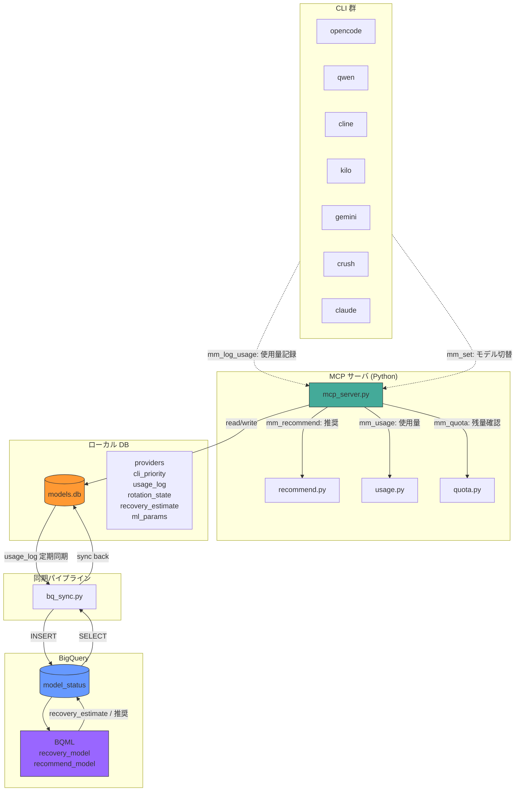

# shizuka 2.0 全体模式図



## データフロー

```
CLI → mm_log_usage → MCP → models.db
                                ↓ bq_sync.py
                           BigQuery (model_status)
                                ↓ BQML
                           recovery_estimate / 推奨
                                ↓ bq_sync.py
                           models.db (反映)
```

## 各レイヤーの責務

| レイヤー | 役割 | 技術 |
|----------|------|------|
| **CLI 群** | モデル設定読み書き・使用量ログ送信 | 各CLIの設定ファイル |
| **MCP サーバ** | CLI操作の窓口・DB CRUD・推奨・使用量グラフ・Quota確認 | Python (mcp_server.py) |
| **models.db** | ローカル状態保持（providers / usage_log / rotation_state / ml_params） | SQLite (WAL) |
| **bq_sync.py** | usage_log → BQ 同期 + BQML結果 ← BQ 反映 | bq CLI / REST API |
| **BigQuery** | 長期間保存・BQML 推論（復帰予測・モデル推奨） | BQML (Linear regression) |
| **BQML** | recovery_estimate・recommend_model の訓練と推論 | CREATE MODEL / ML.PREDICT |
```
