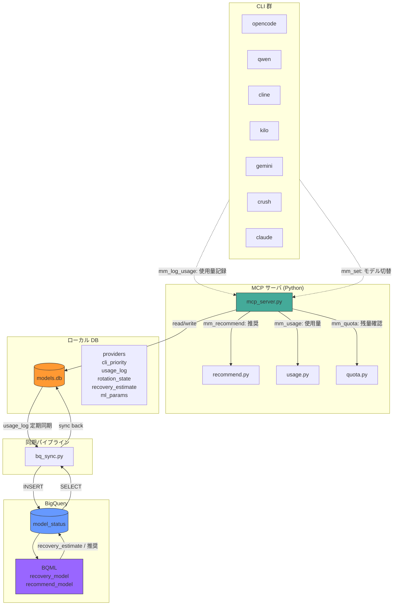

# shizuka 2.0 全体模式図



## 階層構造（3層統合）

```
┌─────────────────────────────────────────────────┐
│  Analytics（統合分析層）                          │
│  コスパ分析・品質/価格比レポート・可視化           │
│  データ元: hamachi（コスト）+ shizuka（使用量）   │
├─────────────────────────────────────────────────┤
│  shizuka（ルーティング層）                        │
│  mm_recommend / mm_log_usage / mm_exhausted      │
│  mm_recovery / mm_quota / mm_status              │
│  ↑ hamachiのコスト情報を参照してスコア補正        │
├─────────────────────────────────────────────────┤
│  hamachi（コスト監視層）                          │
│  API残高確認 / 料金履歴 / アラート / 予測         │
│  ↑ shizukaにコストデータ提供                      │
└─────────────────────────────────────────────────┘
```

## データフロー（3層版）

```
hamachi（コスト監視）
  ├─ DeepSeek API 残高・使用料金 → BQ
  ├─ Sakura API 残高・使用料金 → BQ
  └─ アラート・残日数予測
        ↓ コスト実績データ
shizuka（ルーティング）
  ├─ mm_recommend: 品質スコア × コストペナルティ（hamachiデータ反映）
  ├─ mm_log_usage: session/トークン使用量 → models.db
  ├─ mm_exhausted / mm_recovery: クォータ管理
  └─ mm_quota / mm_balance: 残量確認
        ↓ ルーティング実績 + コスト実績
Analytics（統合分析）
  ├─ 品質/価格比レポート
  ├─ モデル別コスパ可視化
  └─ 「このタスクなら代替モデルで$X節約」提案
```

## 各レイヤーの責務

| 層 | レイヤー | 役割 | データ粒度 | 技術 |
|---|---------|------|-----------|------|
| 🟢 | **hamachi** | API残高・料金履歴・アラート | API単位（$） | cli.py / BQ |
| 🔵 | **shizuka** | モデル推奨・使用量記録・クォータ管理 | session単位（token） | Python FastAPI / Go / SQLite / BQ |
| 🟣 | **Analytics** | コスパ分析・品質/価格比可視化 | 統合（$×token×品質） | （設計中） |

### hamachi（コスト監視層）

**保有データ:**
- API残高（DeepSeek, Sakura 他provider）
- 料金履歴（$単位、API呼び出し単位）
- アラート設定（閾値・通知先）

**責務:**
- 定期残高取得・BQ蓄積
- 使用料金の記録・グラフ化
- 残日数予測・閾値超過アラート
- 監視エージェント（loop）

**提供IF:**
- BQテーブル（`cost_log`）: shizuka / Analytics が参照
- CLI: `balance`, `log`, `usage`, `graph`, `forecast`, `monitor`, `alert-config`

**非責務:**
- モデル品質スコアの管理
- session単位のトークン記録
- モデル推奨判断

---

### shizuka（ルーティング層）

**保有データ:**
- モデル状態（provider / tier / priority）
- session使用量（token単位）
- クォータ状態（残量・枯渇・リカバリー推定）
- モデル品質スコア・コスト参照値

**責務:**
- `mm_recommend`: 品質スコア + コストペナルティ（hamachi実績で補正）
- `mm_log_usage`: session単位のトークン消費記録 → models.db / BQ
- `mm_exhausted / mm_recovery`: クォータ枯渇管理
- `mm_quota / mm_balance`: 残量・残高確認（balanceはhamachi BQ参照）

**提供IF:**
- MCP tools: `mm_recommend`, `mm_status`, `mm_usage`, `mm_log_usage`, `mm_exhausted`, `mm_quota`, `mm_balance`, `mm_recovery`
- BQテーブル（`usage_log`）: Analytics が参照
- models.json: ローカルフォールバック用

**消費:**
- hamachi BQのコストデータ（recommendスコア補正）

**非責務:**
- API残高の一次取得
- $単位の課金集計
- コスパ分析レポート生成

---

### Analytics（統合分析層）— 設計中

**保有データ:**
- （非永続）hamachi × shizuka の結合クエリ結果

**責務:**
- hamachi（コスト実績） × shizuka（使用量・品質） の結合分析
- モデル別・タスク別の実効コスパ算定
- 「このタスクならV4 Flashで$X節約」代替提案
- 品質/価格比の時系列可視化

**消費:**
- hamachi BQ: `cost_log`
- shizuka BQ: `usage_log`, `model_status`

**非責務:**
- 残高・使用量の一次取得
- モデル推奨のリアルタイム判断
- アラート通知

## データフロー（従来版）

```
CLI → mm_log_usage → MCP → models.db
                                ↓ bq_sync.py
                           BigQuery (model_status)
                                ↓ BQML
                           recovery_estimate / 推奨
                                ↓ bq_sync.py
                           models.db (反映)
```
```
