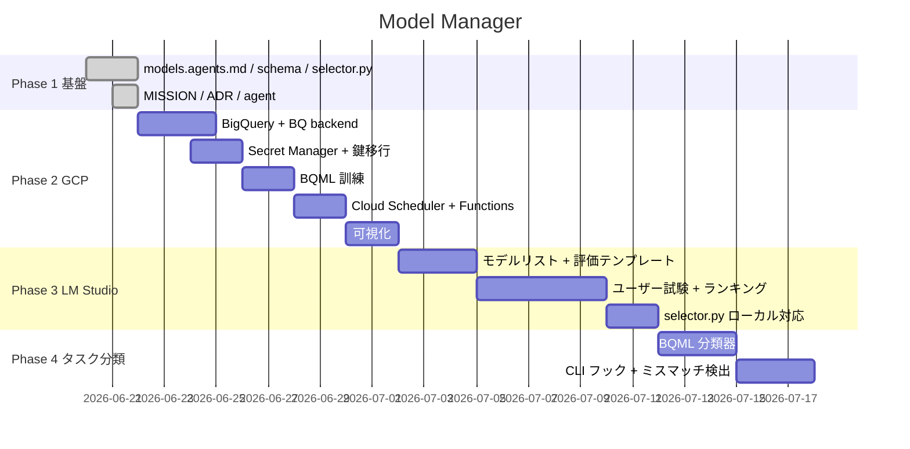

# Model Manager — タスクボード

> 全タスクを構造化。全プロジェクトの source of truth。

## 凡例

| 状態 | 意味 |
|------|------|
| ✅ DONE | 完了 |
| 🔵 TODO | 未着手 |
| 🟡 WIP | 作業中 |
| ⏸ BLOCKED | ブロック中 |

---

## Phase 1: 基盤構築 (完了)

| # | タスク | 状態 | 成果物 |
|---|--------|------|--------|
| 1 | `models.agents.md` — モデル定義YAML + 優先順位 + タスク別推奨 | ✅ DONE | `MEGA/models.agents.md` |
| 2 | SQLite スキーマ設計 (providers / usage_log / quota / rotation_state / recovery_estimate / ml_params) | ✅ DONE | `model-manager/schema.sql` |
| 3 | `selector.py` — ローカルSQLiteバックエンド + 選択エンジン | ✅ DONE | `model-manager/selector.py` |
| 4 | `model-agent.md` — Hermes モデル選択エージェント定義 | ✅ DONE | `.opencode/agents/model-agent.md` |
| 5 | 選択ロジック検証 (ZEN → Qwen → short:DeepSeek / long:Sakura) | ✅ DONE | 全パターン動作確認済 |
| 6 | ADR-005 — DB設置場所・アーキテクチャ決定 | ✅ DONE | `model-manager/ADR-005-db-location.md` |
| 7 | MISSION.md — プロジェクト憲章 | ✅ DONE | `model-manager/MISSION.md` |

---

## Phase 2: GCP 移行 (🔵 TODO)

| # | タスク | 状態 | 説明 |
|---|--------|------|------|
| 8 | BigQuery dataset `model_status` 作成 + DDL | ✅ DONE | providers / usage_log / quota / rotation_state テーブル |
| 9 | `selector.py` BQ バックエンド実装 | ✅ DONE | `bq_backend.py` + `--backend bq` フラグ |
| 10 | Secret Manager に全API鍵登録 | 🔵 TODO | [#1](https://github.com/bonsai/model-manager/issues/1) |
| 11 | `models.agents.md` から生APIキー除去 | 🔵 TODO | [#2](https://github.com/bonsai/model-manager/issues/2) |
| 12 | BQML `recovery_model` 訓練 | 🔵 TODO | [#3](https://github.com/bonsai/model-manager/issues/3) |
| 13 | BQML `recommend_model` 訓練 | 🔵 TODO | [#4](https://github.com/bonsai/model-manager/issues/4) |
| 14 | Cloud Scheduler (3h) → Cloud Functions → auto-select | 🔵 TODO | [#5](https://github.com/bonsai/model-manager/issues/5) |
| 15 | Looker Studio / Connected Sheets 可視化 | 🔵 TODO | [#6](https://github.com/bonsai/model-manager/issues/6) |
| 16 | 各CLI設定ファイル更新 (Secret Manager 参照) | 🔵 TODO | [#7](https://github.com/bonsai/model-manager/issues/7) |

---

## Phase 3: LM Studio モデル評価 (🟡 WIP → 次イシュー)

| # | タスク | 状態 | 説明 |
|---|--------|------|------|
| 17 | ローカル評価用モデルリスト作成 | 🔵 TODO | [#8](https://github.com/bonsai/model-manager/issues/8) |
| 18 | ユーザー試験評価テンプレート設計 | 🔵 TODO | [#9](https://github.com/bonsai/model-manager/issues/9) |
| 19 | 評価実行 + スコアリング | 🔵 TODO | [#10](https://github.com/bonsai/model-manager/issues/10) |
| 20 | ランキング生成 + selector.py 対応 | 🔵 TODO | [#11](https://github.com/bonsai/model-manager/issues/11) |
| 21 | `selector.py` にローカルモデル選択ロジック追加 | 🔵 TODO | task_type × ローカルモデル ranking から最適選択 |
| 22 | 選定フロー自動化 | 🔵 TODO | 新しいモデルが追加されたら自動で評価候補に入れる |

---

## Phase 4: タスク分類自動化 (🔵 TODO)

| # | タスク | 状態 | 説明 |
|---|--------|------|------|
| 23 | 過去の usage_log からタスク種別分類器 BQML 構築 | 🔵 TODO | [#12](https://github.com/bonsai/model-manager/issues/12) |
| 24 | CLI フック: コマンド開始時にタスク種別を自動推定 | 🔵 TODO | プロンプト長・引数から quick/code/long 判定 |
| 25 | ミスマッチ検出アラート | 🔵 TODO | quick タスクに high-quality モデル割当時は警告 |

---

## ロードマップ

